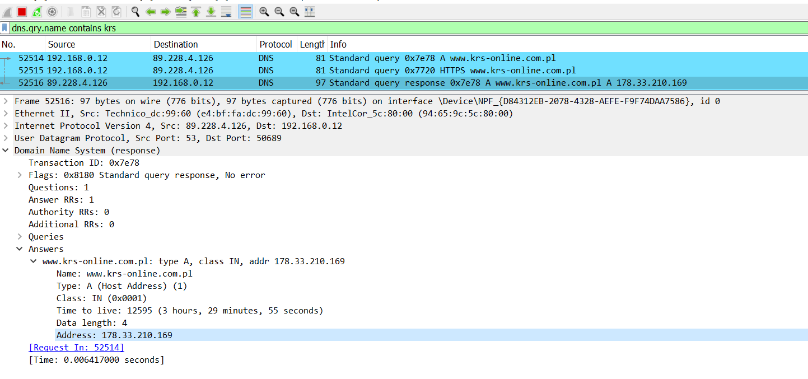
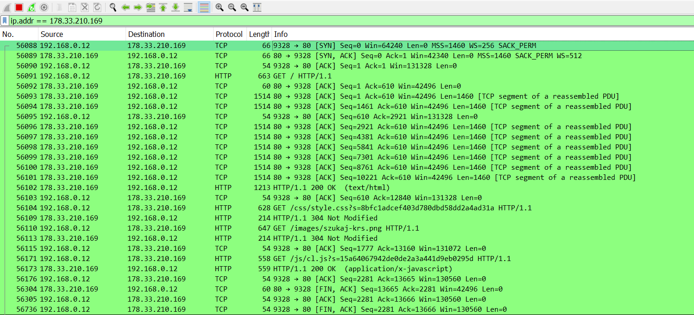
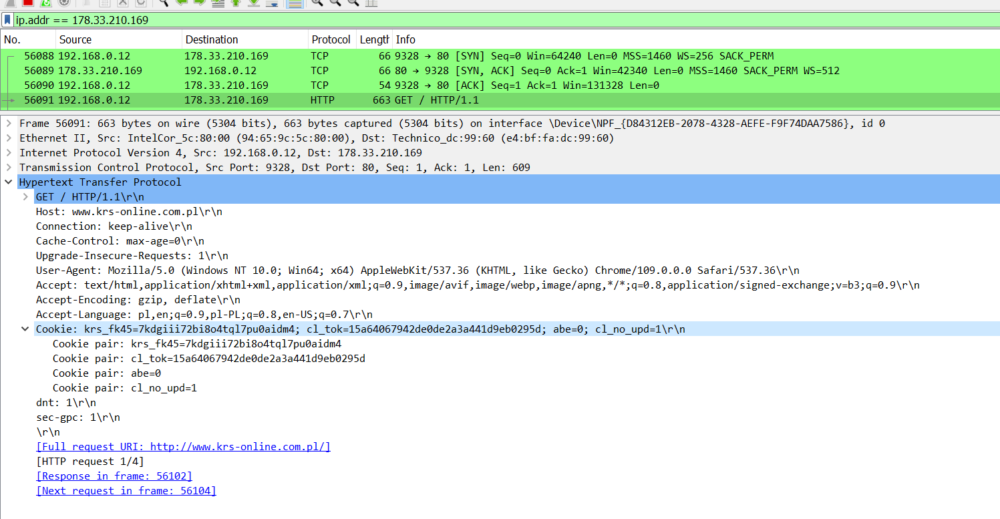
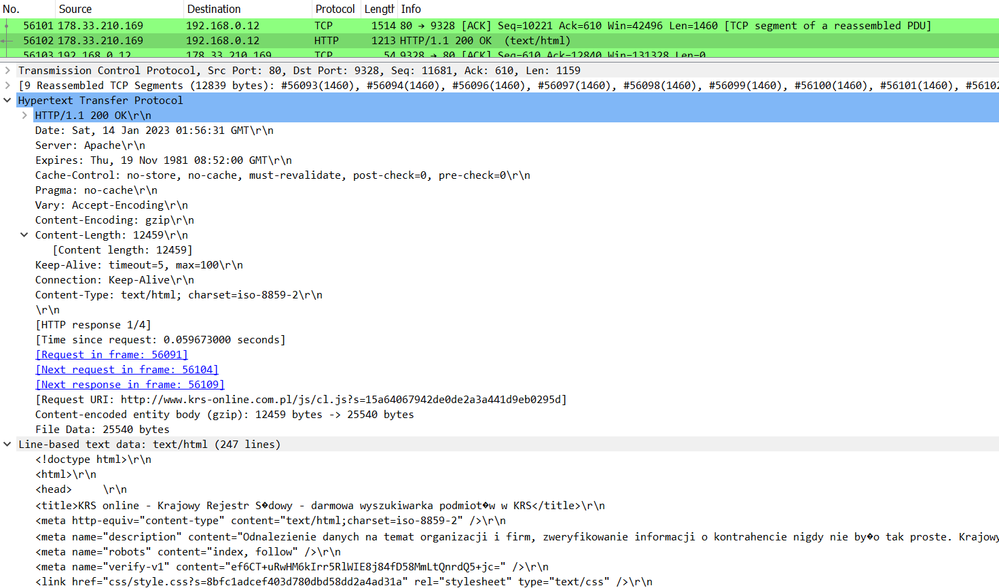
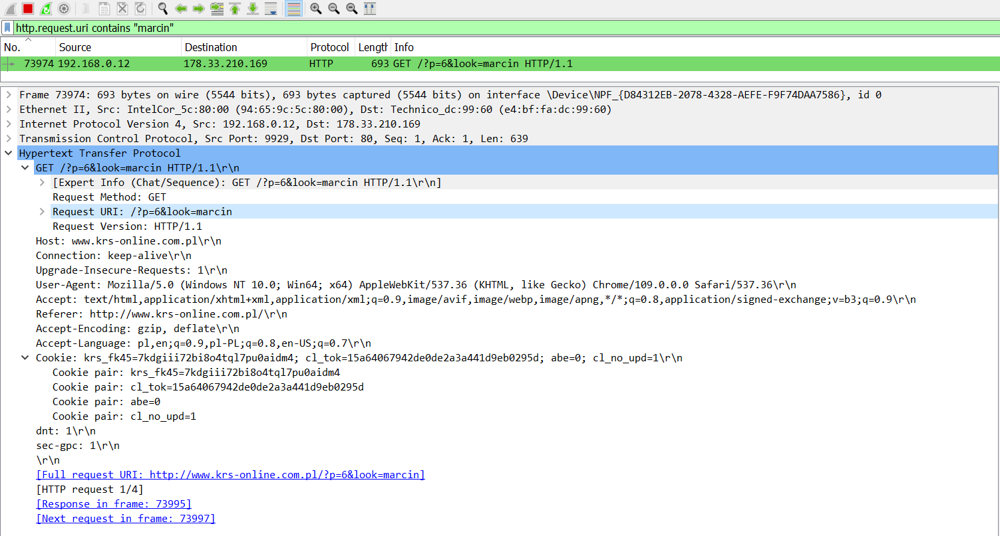
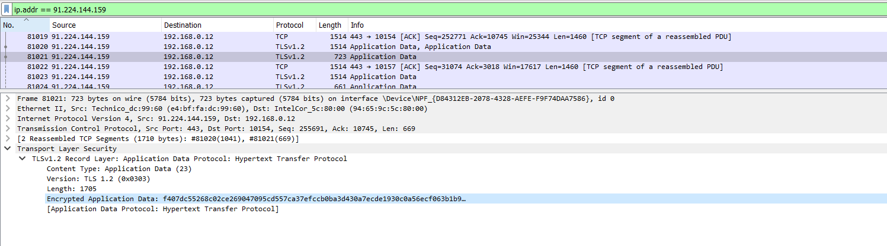
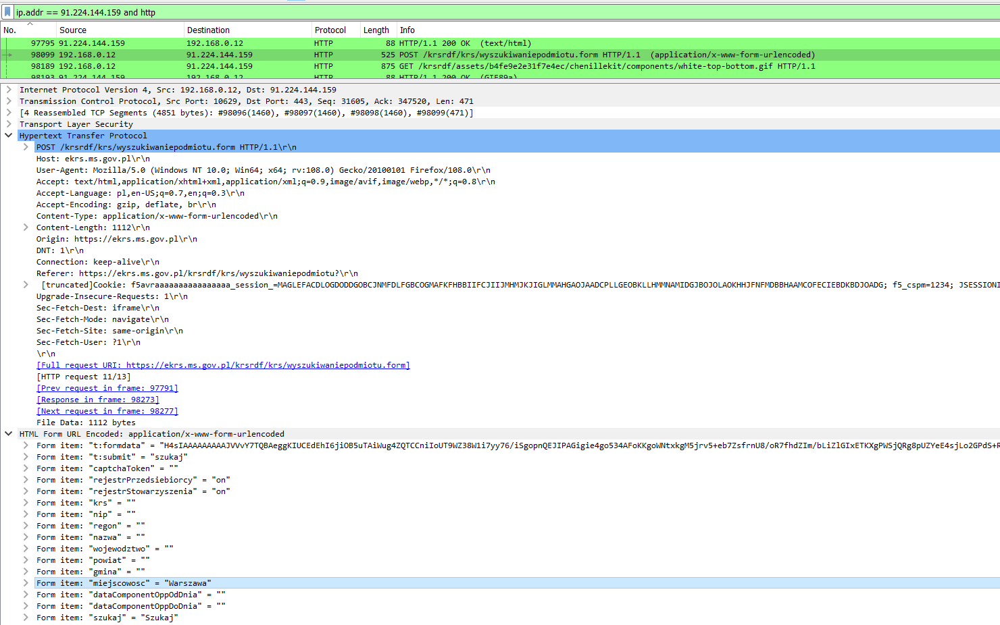
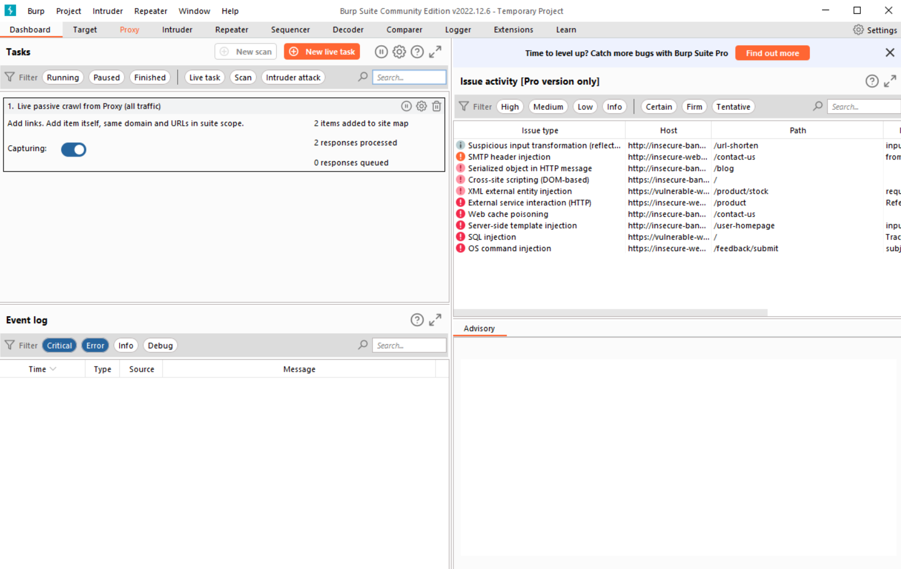
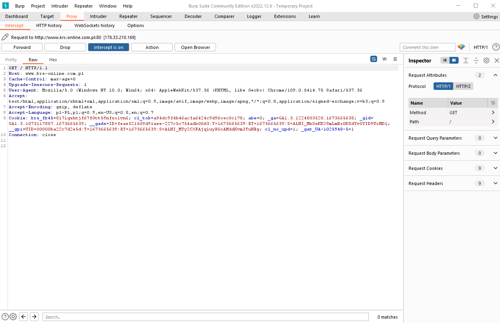
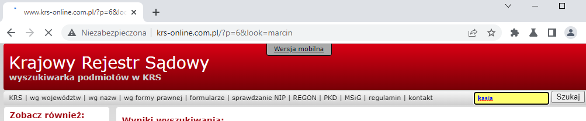

[1. Wireshark](#wireshark)   
[2. Tcpdump](#tcpdump)   
[3. Burp Suite Community Edition](#burp-suite-community-edition)   
[4. DevTools](#devtools)   
[5. Web Serwer](#web-serwer)   
[6. Reverse proxy](#reverse-proxy)   
[7. Dodatkowe materiały](#dodatkowe-materiały)

## Wireshark

### Instalacja
Zainstaluj Wireshark ze [strony producenta](https://www.wireshark.org/download.html)

https://en.wikiversity.org/wiki/Wireshark/Install   
https://www.wireshark.org/docs/wsug_html_chunked/index.html   

### DNS
W razie problemów z działanie protokołu HTTP w pierwszej kolejności warto sprawdzić czy klient jest w stanie rozwiązać adres IP serwera

1. Uruchom Wiresharka
2. Wybierz interfejs
3. Otwórz stronę http://www.krs-online.com.pl/ w przeglądarce
4. W filtrze wyświetlania wprowadź `dns.qry.name contains krs`
5. Zlokalizuj odpowiedź z serwera DNS zawierającą adres IP strony 

### TCP
Jeśli klient rozwiązuje nazwę a nadal nie można uzyskać odpowiedzi z serwera może oznaczać to problemy z nawiązaniem sesji. Poniższe kroki umożliwiają sprawdzenie połączenia TCP

Zmień filtr wyświetlania stosująć znaleziony wcześniej adres IP `ip.addr == 178.33.210.169`. Połączenie zostało nawiązane pomyślnie:


### HTTP
Następną wyższą warstwą jest protokół HTTP. Na tym etapie jesteśmy w stanie sprawdzić czystą postać danych które wysłała przglądarka do serwera

1. Zlokalizuj żądanie `GET /` i sprawdź jak jest zbudowane

2. Znajdź odpowiedź

3. Wpisz swoje imię w wyszukiwarce na stronie
4. Znajdź zapytanie z metodą GET zawierające twoje imię w parametrach w URI `http.request.uri contains "marcin"`
 Dane przesłane do serwera nie są w żaden sposób zaszyfrowane

### HTTPS
1. Wejdź na stronę inną podobną stronę lecz obsługującą HTTPS, np. https://ekrs.ms.gov.pl/web/wyszukiwarka-krs/strona-glowna/index.html
2. Zaznacz oba pola pod napisem "Rejestry" i wpisz "Warszawa" w polu miejscowość
3. Postaraj się zlokalizować komunikację z serwerem ekrs.ms.gov.pl

Jak widać dane są zaszyfrowane. Możliwe jest odszyfrowanie po uzyskaniu dostępu do kluczy z przeglądarki.

4. [Windows] Zamknij przeglądarkę Firefox jeśli z niej korzystasz. Uruchom plik firewall.cmd. Jeśli nie posiadasz zainstalowanego Firefoxa, edytuj trzecią linię pliku by uruchomić inną przeglądarkę.

    [Inne systemy] Zamknij przeglądarkę. Otwórz terminal. Wykonaj komendę `export SSLKEYLOGFILE="/home/<account_name>/Desktop/keylogfile.txt"`.

    Uruchom przeglądarkę z terminala `Firefox &`

     Po uruchomieniu jakiejkolwiek strony na pulpicie w profilu użytkownika powinien pojawić się plik keylogfile.txt

    https://wiki.wireshark.org/TLS#tls-decryption

5. Uruchom Wiresharka
6. Wybierz interfejs
7. Wskaż pełną ścieżkę pliku keylogfile.txt w Edit > Preferences > Protocols > TLS > (Pre)-Master-Secret log filename i zapisz zmiany
8. Wykonaj ponownie poprzednią operację, lecz korzystając z nowego okna przeglądarki
9. Wróć do Wiresharka. Ruch HTTP powinien być odszyfrowane
10. Postaraj się znaleźć żądanie POST
. Zwróc uwagę na budowę żądania POST

Czy nagłówki `Content-Type` oraz `Content-Length` są wysyłane w żądaniach GET?

Gratulacje! Wiesz już jak sprawdzić ruch DNS, TCP i  przeanalizować komunikację HTTP oraz HTTPS.

## Tcpdump
Wireshark sprawdzi się dobrze gdy mamy GUI, a co gdy nie mamy? Nie stanowi to większego problemu. W Linuxach dostępne jest narzędzie Tcpdump.

1. Otwórz dwa okna terminala
2. W jednym uruchom `sudo tcpdump port dns -n`. W drugim `curl http://training.securitum.com/`. Obserwuj wynik tcpdumpa
3. Zatrzymaj tcpdump poprzez Ctrl+C
4. Uruchom ponownie `sudo tcpdump port http` oraz komendę curl
5. Zatrzymaj jeszcze raz. Uruchom `sudo tcpdump port http -vvv`. Wykonaj żądanie OPTIONS `curl http://training.securitum.com/ -X OPTIONS -v`, `curl http://training.securitum.com/`


## Burp Suite Community Edition
Wiesz jak sprawdzić komunikację HTTP, ale czy wiesz jak ją zmodyfikować w prosty sposób? Na przykład jak zmienić nagłowki żądanie lub odpowiedzi?

1. Zainstaluj narzędzie [Burp Suite Community Edition](https://portswigger.net/burp/releases/community/latest) ze strony producenta

    Docs:
    https://portswigger.net/burp/documentation/desktop/getting-started/download-and-install

2. Uruchom Burp
3. Klikaj "next" do czasu pojawienia się dashboardu

4. Kliknij Proxy > Open Browser
5. Przejdź do [strony KRS z punktu](#dns).
6. Przeglądarka czeka na odpowiedź, lecz żądanie zostało zatrzymane przez Burp Suite. Kliknij Forward

7. Możesz wstrzymać przechwytywanie ruchu HTTP klikając "Intercept is on". Przywrócenie możliwe jest tym samym przyciskiem.
8. Przywróć przechwytywanie. Wpisz swoje imie w wyszukiwarce. Wróc do Burpa.
9. Znajdź swoje imię w pierwszej linii, zmień je na inne i kliknij Forward
10. Mimo że w adresie na pasku przeglądarki widzisz swoje imie to wyniki wyszukiwania oraz w polu wyszukiwania widoczne jest zmienione imię.

11. Zapoznaj się z zakładką HTTP history. Znaleźć w niej możesz historię żądań oraz odpowiedzi
12. Przejdź na stronę https://stackoverflow.com/questions i wprowadź filtry
13. Zlokalizuj zapytanie GET z filtrami w parametrach. Kliknij na nie prawym przyciskiem i wybierz "Send to repeater".
14. Wejdź do zakładki Repeater
15. Usuń wszystkie nagłówki od drugiego pozostawiając jedynie User-Agent oraz dwie puste linie na końcu. Wyślij zapytanie
Zmień wersję protokołu na HTTP/1 korzystając z przycisku po prawej stronie w oknie Inspector. Usuń ostatnią linię zostawiając jedną pustą linię kończącą zapytanie a następnie wyślij. Ilość pustych linii w HTTP/1 ma znaczenie!
16. Przywróć wersję HTTP/2. Przełącz widok na Render w oknie Response.Zmień Newest na RecentActivity w pierwszej linii i wyślij.
17. Kliknij prawym przyciskiem na pole żądania i wybierz "Change request method". Burp automatycznie zmienił metodę GET na POST oraz przeniósł parametry do ciała żądania. Wyślij

https://portswigger.net/burp/documentation/desktop

Wiesz jak sprawdzać komunikację HTTP bez dodatkowego narzutu informacji z innych warstw jak w przypadku Wiresharka. Potrafisz modyfikować zapytania oraz ponownie wysyłać do serwera. Wiesz że standard ma znaczenie

## DevTools
Dużo łatwiej operować na danych w Burpie porównując nawigowanie w Wiresharku, ale co w przypadku gdy nie chcesz nic instalować. Bardziej ograniczoną opcją, lecz wbudowaną w przeglądarce jest narzędzie DevTools. Dodatkową zaletą narzędzia jest możliwość analizowania ile czasu przeglądarka potrzebuje na przetworzenie konkretnych elementów.

1. Uruchom przeglądarkę. Uruchom DevTools poprzez F12.
2. Przejdź do zakładki sieć/network
3. Wykonaj kilka zapytań
4. Wejdź na stronę **http**://wp.pl. Analizując jedynie odpowiedzi w domenie (www).wp.pl postaraj się określić w jaki sposób protokół zmienił się z HTTP na HTTPS
2. Porównaj DevTools w innych przeglądarach

https://developer.chrome.com/docs/devtools/   
https://firefox-source-docs.mozilla.org/devtools-user/   

## Web Serwer

Wiesz jak sprawdzać oraz modyfikować ruch, ale jak uruchomić własny serwer w podstawowej konfiguracji?

Po co umieszczać aplikacje na web serwerach skoro frameworki mają wbudowane web serwery
- https://expressjs.com/en/advanced/best-practice-performance.html#use-a-reverse-proxy
- https://docs.djangoproject.com/en/4.1/ref/django-admin/#runserver
- https://www.quora.com/Why-do-I-need-a-web-server-to-run-PHP-even-if-the-site-I-develop-is-only-for-me-to-access
- https://flask.palletsprojects.com/en/2.2.x/deploying/#deploying-to-production

[Linux]

0. Jeśli nie pracujesz na Linuxie możesz utworzyć maszynę korzystając z Vagranta
    ```
    vagrant init ubuntu/focal64
    vagrant up
    vagrant ssh
    ```
1. Zainstaluj web serwer `sudo apt install nginx`
2. Sprawdź status usługi `sudo systemctl status nginx`
3. Wyślij zapytanie do web serwera
`curl localhost`
Serwer powinien zwrócić kod HTML:
    ```html
    <!DOCTYPE html>
    <html>
    <head>
    <title>Welcome to nginx!</title>
    <style>
        body {
            width: 35em;
            margin: 0 auto;
            font-family: Tahoma, Verdana, Arial, sans-serif;
        }
    </style>
    </head>
    <body>
    <h1>Welcome to nginx!</h1>
    <p>If you see this page, the nginx web server is successfully installed and
    working. Further configuration is required.</p>

    <p>For online documentation and support please refer to
    <a href="http://nginx.org/">nginx.org</a>.<br/>
    Commercial support is available at
    <a href="http://nginx.com/">nginx.com</a>.</p>

    <p><em>Thank you for using nginx.</em></p>
    </body>
    </html>
    ```
3. Wykonaj kilka zapytań i porównaj wyniki
```
curl localhost -v
curl -X POST localhost
curl -X OPTIONS localhost
```
4. Utwórz nową stronę
```
sudo mkdir -p /var/www/training/html
sudo chown -R $USER:$USER /var/www/training/html
sudo chmod -R 755 /var/www

nano /var/www/training/html/index.html
```

```
<html>
    <head>
        <title>Infoshare Academy DevOps training</title>
    </head>
    <body>
        <h1>Success! The training server is working!</h1>
    </body>
</html>
```
```
sudo cp /etc/nginx/sites-available/default /etc/nginx/sites-available/training
sudo nano /etc/nginx/sites-available/training
```
File content
```
server {
        listen 80;
        listen [::]:80;

        root /var/www/training/html;
        index index.html index.htm index.nginx-debian.html;

        server_name training;

        location / {
                try_files $uri $uri/ =404;
        }
}
```
- `listen` - na jakim porcie strona nasłuchuje
- `root` - główny katalog stron
- `index` - plik ładowany domyślnie
- `server_name` - określa nagłówek host który musi znaleźć się w żądaniu by dotarło do danej strony
- `location` - określa URI storny
- `try_files` - jeśli nie znajdzie plików lub katalogów określonych zmienną $uri, to zwróci 404

Enable website
```
sudo ln -s /etc/nginx/sites-available/training /etc/nginx/sites-enabled/
sudo nginx -t
sudo nginx -s reload
```

5. Przetestuj działanie strony, dodając nagłówek Host do żądania GET
`curl localhost --header "Host: training"`

## Reverse proxy
Reverse proxy to serwer który znajduje się przed serwerami docelowymi i przekazuje żądania do tych serwerów. Reverse proxy wdrażane są zwykle w celu zwiększenia bezpieczeństwa, wydajności oraz niezawodności aplikacji.

Reverse proxy pozwala między innymi na:
- modyfikacja żądań i odpowiedzi
- ochrona przed atakami
- loadbalancing
- jedna domena, wiele aplikacji
- ukrycie aplikacji/maszyn/kontenerów
- caching
- szyfrowanie i deszyfrowanie TLS
- uwierzytelnienie


Prosty przykład konfiguracji reverse proxy. Utworzony strona training oraz strona domyślna symulują będą symulowały serwery docelowe.

1. Utwórz nowy site `sudo cp /etc/nginx/sites-available/default /etc/nginx/sites-available/reverse-proxy`
2. Dodaj definicję przekierowania ruchy w naspisując plik reverse-proxy
```
server {
    listen 80;
    listen [::]:80;

    server_name reverse-proxy;

    location /default {
        proxy_pass http://localhost/;
    }

    location /training {
        proxy_pass http://localhost/;
        proxy_set_header Host training;
    }

#    location /kursnbp {
#        proxy_pass http://api.nbp.pl/api/cenyzlota;
#    }

#    location /pogoda {
#        proxy_pass https://danepubliczne.imgw.pl/api/data/synop/station/jeleniagora;
#    }
}
```

- `proxy_pass` - określa adres na jaki żądanie zostanie prekierowane
- `proxy_set_header` - ustawia nagłówek do żądanie które zostanie przesłane do serwera docelowego

3. Zrestartuj serwer `sudo sytemclt restart nginx`
4. Sprawdź połączenie
```
curl localhost/training --header "Host: reverse-proxy"
curl localhost/default --header "Host: reverse-proxy"
```

## Dodatkowe materiały

1. [Protokół http – podstawy](https://sekurak.pl/protokol-http-podstawy/)
2. [Mozilla HTTP Docs](https://developer.mozilla.org/en-US/docs/Web/HTTP)
3. [HTTP: 1.0 vs. 1.1 vs 2.0 vs. 3.0](https://www.baeldung.com/cs/http-versions)
4. [Burp Suite - dokumentacja](https://portswigger.net/burp/documentation)
5. [Web Security training*](https://portswigger.net/web-security)
6. [Cloudflare Radar](https://radar.cloudflare.com/)
7. [NGINX - przykłady konfiguracji](https://www.freecodecamp.org/news/the-nginx-handbook/)
8. [NGINX + PHP - tutorial](https://www.digitalocean.com/community/tutorials/php-fpm-nginx)
9. [NGINX + HTTPS - tutorial](https://www.digitalocean.com/community/tutorials/how-to-secure-nginx-with-let-s-encrypt-on-ubuntu-20-04)
10. [Reverse proxy](https://www.cloudflare.com/learning/cdn/glossary/reverse-proxy/)
